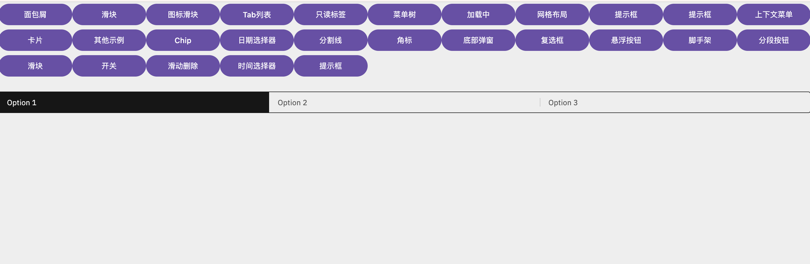

# KMP-DevToy
<div align="center">

[](https://kotlinlang.org/docs/multiplatform.html)
[](https://developer.android.com/develop/ui/compose)
</div>

## 项目简介

这是一个基于 Kotlin Multiplatform (KMP) 技术实现的开发工具，参考了 devToy 工具的设计理念。项目采用现代化的 Compose 跨平台框架，支持在多个桌面平台上运行。

## 核心特性

- &zwnj;**跨平台支持**&zwnj;: 基于 Kotlin Multiplatform，实现代码在多个平台间的共享
- &zwnj;**现代化 UI**&zwnj;: 使用 Jetpack Compose 构建响应式用户界面
- &zwnj;**桌面应用**&zwnj;: 专为桌面环境优化的原生体验
- &zwnj;**简洁高效**&zwnj;: 轻量级工具，快速启动和运行
### 示例图片

### 参考文档
- [Carbon Compose](https://gabrieldrn.github.io/carbon-compose/)
- [compose Android Document](https://developer.android.com/develop/ui/compose/documentation?hl=zh-cn)
- [Calf](https://github.com/MohamedRejeb/Calf)
- [KMP示例](https://klibs.io/?platforms=jvm)
### 环境要求

- Gradle 8.0 或更高版本
- Kotlin 1.9.0 或更高版本
### 项目运行命令:
- on macOS/Linux
  ```shell
  ./gradlew :composeApp:run
  ```
- on Windows
  ```shell
  .\gradlew.bat :composeApp:run
  ```

---

Learn more about [Kotlin Multiplatform](https://www.jetbrains.com/help/kotlin-multiplatform-dev/get-started.html)…