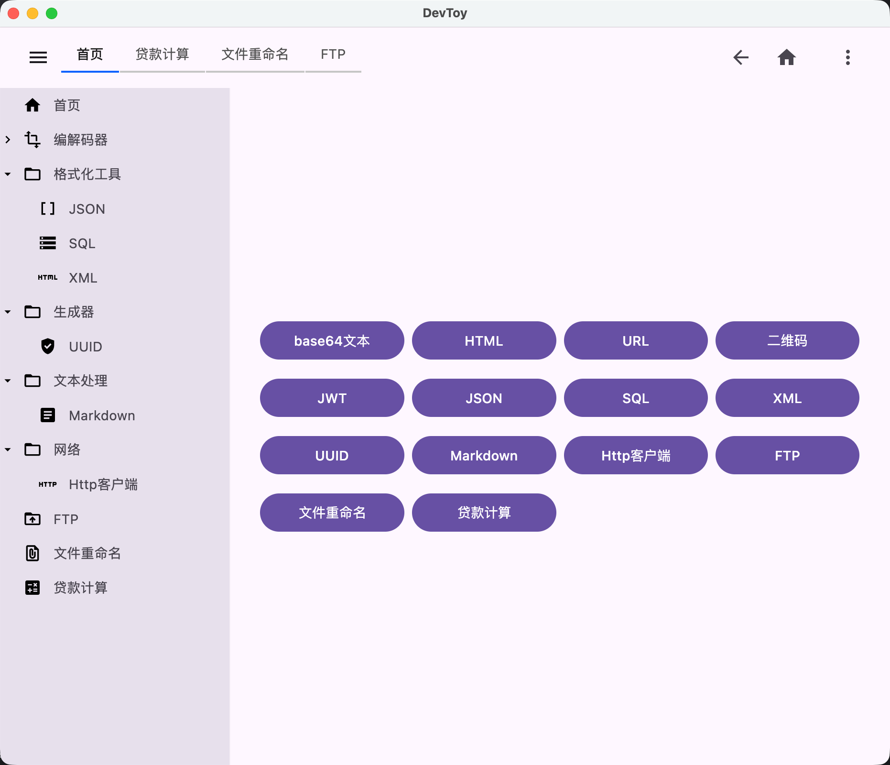
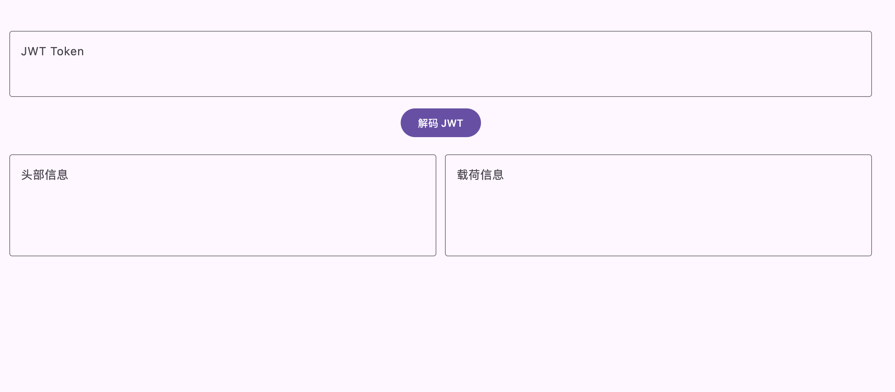
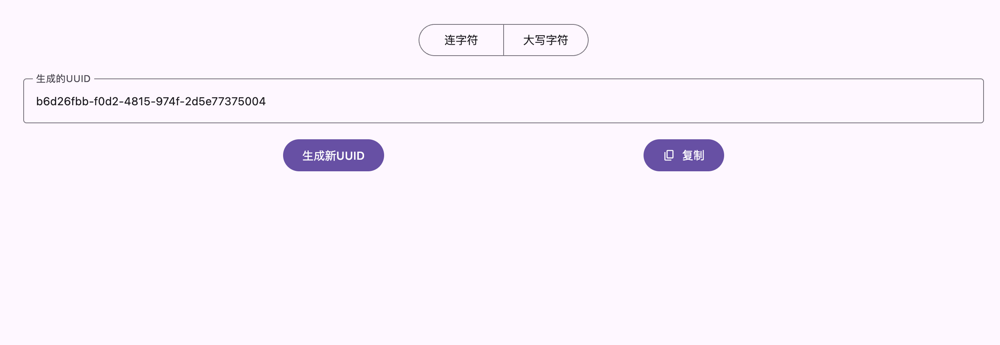

# KMP-DevToy
<div style="text-align: center;">

[](https://kotlinlang.org/docs/multiplatform.html)
[](https://developer.android.com/develop/ui/compose)
</div>

## 项目简介

这是一个基于 Kotlin Multiplatform (KMP) 技术实现的开发工具，参考了 devToy 工具的设计理念。项目采用现代化的 Compose 跨平台框架，支持在多个桌面平台上运行。

## 核心特性

- &zwnj;**跨平台支持**&zwnj;: 基于 Kotlin Multiplatform，实现代码在多个平台间的共享
- &zwnj;**现代化 UI**&zwnj;: 使用 Jetpack Compose 构建响应式用户界面
- &zwnj;**桌面应用**&zwnj;: 专为桌面环境优化的原生体验
- &zwnj;**简洁高效**&zwnj;: 轻量级工具，快速启动和运行

## 支持功能
- [x] 编解码器：
  - [x] base64
  - [x] base85文本文件
  - [x] Html
  - [x] url
  - [x] 二维码
  - [x] JWT
- [x] 格式化：
  - [x] json 
  - [x] sql 
  - [x] xml
  - [x] yaml<>json
- [ ] 生成器：
  - [x] uuid 
- [ ] 文本处理：
  - [x] markdown
  - [x] 正则速查
  - [x] 转换大小写
  - [x] 文本比对
- [x] 网络：
  - [x] http客户端
- [x] FTP：
  - [x] sftp客户端 
  - [x] ftp客户端
- [x] 文件处理：
  - [x] 批量重命名
  - [x] 文件编码转换
- [x] 贷款计算器
- [x] 时间戳转换
- [x] java反编译器
### 示例图片
首页
  
base85文本文件

jwt

时间戳转换

uuid

文件重名名

yaml/json转换

二维码

文本比对

java文件反编译

正则速查

http客户端

贷款计算器

ftp客户端

### 参考文档
- [Carbon Compose](https://gabrieldrn.github.io/carbon-compose/)
- [compose Android Document](https://developer.android.com/develop/ui/compose/documentation?hl=zh-cn)
- [Calf](https://github.com/MohamedRejeb/Calf)
- [KMP示例](https://klibs.io/?platforms=jvm)
- [图标库](https://fonts.google.com/icons)
### 环境要求

- Gradle 8.0 或更高版本
- Kotlin 1.9.0 或更高版本
### 项目运行命令:
- on macOS/Linux
  ```shell
  ./gradlew :composeApp:run
  ```
- on Windows
  ```shell
  .\gradlew.bat :composeApp:run
  ```

---

Learn more about [Kotlin Multiplatform](https://www.jetbrains.com/help/kotlin-multiplatform-dev/get-started.html)…